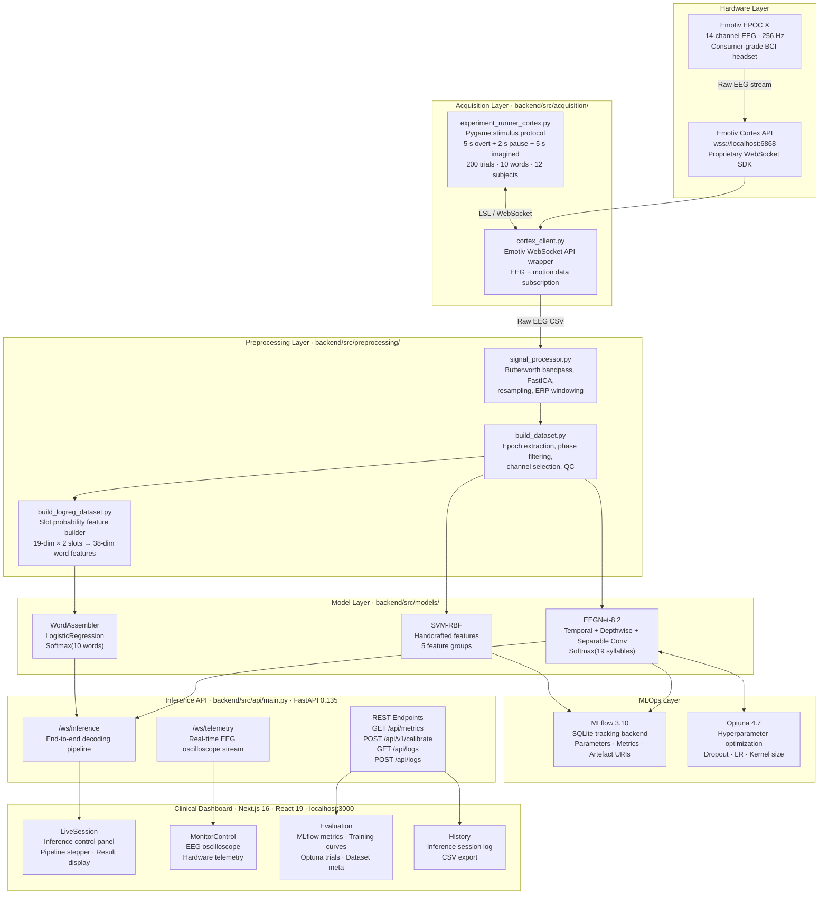
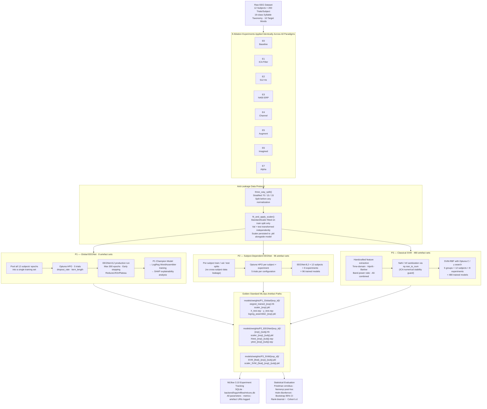
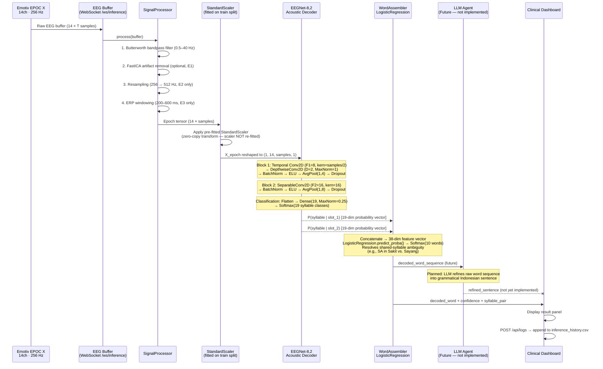

# NEURANDIAR-BCI

**Real-Time EEG-Based Imagined Speech Decoding via Decoupled Acoustic-Language Architecture**


---

## Abstract

NEURANDIAR is a Brain-Computer Interface (BCI) research prototype developed as an undergraduate thesis at Institut Teknologi Sepuluh Nopember (ITS). The system decodes imagined and overt speech from 14-channel EEG signals recorded using the Emotiv EPOC X consumer-grade headset, classifying 19 Indonesian syllables and assembling them into 10 clinically relevant target words. The overarching research question is whether consumer-grade EEG can sustain reliable syllable-level imagined speech decoding for clinical communication assistance applications.

The investigation employs a three-paradigm, eight-experiment ablation framework yielding 584+ trained model artefacts, evaluated with a rigorous non-parametric statistical pipeline (Friedman omnibus test, Nemenyi post-hoc, Holm-Bonferroni correction, rank-biserial effect sizes, bootstrap 95% confidence intervals). P1, P2, and P3 are final and form the basis of the thesis results; the current champion configuration is **P3 / E5_Data_Augmentation / subject S3 / Barlow features (18.10% test accuracy, 18/19 class coverage)**. Four supplementary single-variable paradigms (P4–P7) extending this champion configuration are documented in [Section 12](#12-supplementary-experiments-p4p7).

**Author:** Andiar Rinanda Agastya
**Institution:** Institut Teknologi Sepuluh Nopember (ITS), Department of Informatics
**Device:** Emotiv EPOC X, 14-channel EEG, 256 Hz native sampling rate
**Dataset:** 12 subjects · 200 trials/subject · 19-class syllable taxonomy · 10 target words

---

## Table of Contents

- [NEURANDIAR-BCI](#neurandiar-bci)
  - [Abstract](#abstract)
  - [Table of Contents](#table-of-contents)
  - [1. System Architecture](#1-system-architecture)
  - [2. Three-Paradigm MLOps Training Pipeline](#2-three-paradigm-mlops-training-pipeline)
  - [3. Inference Pipeline: Acoustic-Language Decoupling](#3-inference-pipeline-acoustic-language-decoupling)
  - [4. Hardware and Dataset Specifications](#4-hardware-and-dataset-specifications)
    - [EEG Hardware](#eeg-hardware)
    - [Dataset](#dataset)
    - [19-Class Syllable Taxonomy](#19-class-syllable-taxonomy)
  - [5. Technology Stack](#5-technology-stack)
    - [Backend](#backend)
    - [Frontend](#frontend)
    - [Infrastructure](#infrastructure)
  - [6. Repository Structure](#6-repository-structure)
  - [7. MLOps Directory Structure (Golden Standard)](#7-mlops-directory-structure-golden-standard)
  - [8. Experiment Grid: E0–E7](#8-experiment-grid-e0e7)
  - [9. Deep Technical Definitions](#9-deep-technical-definitions)
    - [9.1 EEGNet-8,2 Architecture](#91-eegnet-82-architecture)
    - [9.2 Anti-Leakage Data Protocol](#92-anti-leakage-data-protocol)
    - [9.3 Acoustic-Language Decoupling](#93-acoustic-language-decoupling)
    - [9.4 Statistical Evaluation Pipeline](#94-statistical-evaluation-pipeline)
    - [9.5 SHAP GradientExplainer](#95-shap-gradientexplainer)
  - [10. Installation and Environment Setup](#10-installation-and-environment-setup)
    - [Prerequisites](#prerequisites)
    - [Step 1 — Clone the Repository](#step-1--clone-the-repository)
    - [Step 2 — Backend Python Environment](#step-2--backend-python-environment)
    - [Step 3 — Environment Variables](#step-3--environment-variables)
    - [Step 4 — Frontend Node Environment](#step-4--frontend-node-environment)
  - [11. Usage Guide for Future Researchers](#11-usage-guide-for-future-researchers)
    - [11.1 System Integrity Check (Always Run First)](#111-system-integrity-check-always-run-first)
    - [11.2 Starting the Backend API](#112-starting-the-backend-api)
    - [11.3 Starting the Frontend Dashboard](#113-starting-the-frontend-dashboard)
    - [11.4 Running the P1 Global Training Pipeline](#114-running-the-p1-global-training-pipeline)
    - [11.5 Running the P2 Subject-Dependent EEGNet Grid](#115-running-the-p2-subject-dependent-eegnet-grid)
    - [11.6 Running the P3 Classical SVM Feature Ablation Grid](#116-running-the-p3-classical-svm-feature-ablation-grid)
    - [11.7 Running the P4–P7 Supplementary Experiment Orchestrator](#117-running-the-p4p7-supplementary-experiment-orchestrator)
    - [11.8 Replicating the Q1 Journal Analysis (Jupyter Notebook)](#118-replicating-the-q1-journal-analysis-jupyter-notebook)
  - [12. Supplementary Experiments: P4–P7](#12-supplementary-experiments-p4p7)
  - [13. Implementation Status](#13-implementation-status)
  - [14. Future Work and Research Roadmap](#14-future-work-and-research-roadmap)
  - [15. Research Acknowledgements](#15-research-acknowledgements)

---

## 1. System Architecture

The end-to-end system spans four layers: physical hardware, acquisition, a multi-paradigm training and inference backend, and a clinical-grade Next.js dashboard. All layers communicate via standardized interfaces (WebSocket, REST, LSL).



---

## 2. Three-Paradigm MLOps Training Pipeline

Three independent paradigms are trained across eight identical ablation conditions, enabling direct cross-paradigm and within-paradigm comparisons under controlled preprocessing variables.



---

## 3. Inference Pipeline: Acoustic-Language Decoupling

The inference architecture deliberately separates two cognitive levels of the decoding problem. The **Acoustic Decoder** (EEGNet) operates at the neurophysiological signal level, classifying individual syllables from raw EEG epochs. The **Language Assembler** (LogisticRegression) operates at the lexical level, mapping the probability distributions emitted by two sequential syllable slots into a word-class decision.

This decoupling is architecturally motivated: the 10 target words share syllabic constituents (e.g., the syllable `SA` appears in both *Sakit* and *Sayang*), making a direct EEG-to-word mapping ill-posed. By exposing the full 19-dimensional probability vector from each slot — rather than a hard argmax — the word assembler can resolve lexical ambiguity using the joint conditional distribution over both slots simultaneously.



---

## 4. Hardware and Dataset Specifications

### EEG Hardware

| Parameter | Specification |
|-----------|--------------|
| Device | Emotiv EPOC X |
| Electrode count | 14 active channels + 2 reference (CMS/DRL) |
| Channel layout | AF3, F7, F3, FC5, T7, P7, O1, O2, P8, T8, FC6, F4, F8, AF4 (10–20 system) |
| Native sampling rate | 256 Hz |
| Resolution | 14-bit ADC |
| Connectivity | Bluetooth 5.0 (2.4 GHz) |
| SDK | Emotiv Cortex API v2 (WebSocket, `wss://localhost:6868`) |
| Acquisition protocol | overt speech (5 s) → silence pause (2 s) → imagined speech (5 s) |

### Dataset

| Parameter | Value |
|-----------|-------|
| Subjects | 12 (S1–S12) |
| Trials per subject | 200 (20 per word × 10 words) |
| Block size | 20 trials per recording block |
| Recording phases | 2 per trial: overt + imagined |
| Syllable classes | 19 (see taxonomy below) |
| Word classes | 10 |
| Chance level | 5.26% (1/19 for syllable classification) |

### 19-Class Syllable Taxonomy

The 10 target words decompose into 19 unique syllabic units. The syllable `SA` is shared between *Sakit* and *Sayang*, creating the lexical ambiguity that motivates the two-stage Acoustic-Language decoupling architecture.

| Word (Indonesian) | Translation | Slot 1 Syllable | Slot 2 Syllable |
|-------------------|-------------|-----------------|-----------------|
| Makan | eat | MA | KAN |
| Minum | drink | MI | NUM |
| Berak | defecate | BE | RAK |
| Pipis | urinate | PI | PIS |
| Mandi | bathe | MAN | DI |
| Bosan | bored | BO | SAN |
| Lelah | tired | LE | LAH |
| Sakit | pain / sick | SA *(shared)* | KIT |
| Tidur | sleep | TI | DUR |
| Sayang | love / dear | SA *(shared)* | YANG |

---

## 5. Technology Stack

### Backend

| Component | Library / Version | Role |
|-----------|------------------|------|
| Deep learning | TensorFlow 2.21.0 · Keras 3.13.2 | EEGNet-8,2 training and inference |
| Classical ML | scikit-learn 1.8.0 | SVM-RBF, LogisticRegression, StandardScaler |
| HPO | Optuna 4.7.0 | Hyperparameter search (dropout, kernel, LR) |
| Experiment tracking | MLflow 3.10.1 | Parameter logging, metric tracking, artefact registry |
| Interpretability | SHAP 0.51.0 | GradientExplainer channel importance |
| Signal processing | NumPy 2.4.3 · SciPy 1.17.1 | Filtering, resampling, feature extraction |
| Numerical analysis | pandas 2.3.3 · seaborn 0.13.2 | Statistical aggregation and visualization |
| API framework | FastAPI 0.135.1 · uvicorn 0.41.0 | REST and WebSocket inference server |
| Data acquisition | pylsl 1.18.1 | Lab Streaming Layer EEG synchronization |
| Serialization | h5py 3.14.0 · joblib 1.5.3 | Model weights (.h5) and scaler (.pkl) persistence |

### Frontend

| Component | Library / Version | Role |
|-----------|------------------|------|
| Framework | Next.js 16.2.4 · React 19.2.4 | Clinical dashboard SPA |
| Language | TypeScript 5.7.3 | Type-safe component development |
| Styling | Tailwind CSS 4.2 | Utility-first layout and theming |
| UI primitives | Radix UI (full suite) · shadcn/ui | Accessible component library |
| Charts | Recharts 2.15 | EEG oscilloscope and accuracy trend charts |
| Forms | React Hook Form 7.54 · Zod 3.24 | Validated input components |

### Infrastructure

| Component | Detail |
|-----------|--------|
| Python version | 3.10 or later (3.11 recommended) |
| Node.js version | 18 LTS or later |
| OS | Windows 11 (primary), Ubuntu 22.04+ (compatible) |
| GPU (optional) | CUDA 12.x + cuDNN 8.x (accelerates EEGNet training; inference runs on CPU) |
| Storage | Minimum 4 GB for full model artefact set (584+ files) |

---

## 6. Repository Structure

```
neurandiar-bci/
├── backend/
│   ├── dataset/
│   │   └── raw/                        # Raw EEG CSV files and experiment logs
│   │       └── logs/                   # Per-subject _experiment_log.txt files
│   ├── logs/
│   │   ├── mlflow/
│   │   │   └── mlruns.db               # MLflow SQLite tracking database
│   │   └── inference_history.csv       # Runtime inference session log
│   ├── models/
│   │   └── weights/                    # Golden Standard artefact root
│   │       ├── P1_Global/              # Global EEGNet (8 experiment dirs)
│   │       ├── P2_EEGNet/              # Subject-dependent EEGNet (8 × 12)
│   │       ├── P3_SVM/                 # Classical SVM (8 × 12 × 5 feature groups)
│   │       ├── P4_TransferLearning/    # Calibrated/ = production new-user calibration artefacts only
│   │       │                           # (unrelated to the P4 research paradigm below — see Section 12)
│   │       ├── P4_NoWindowing/         # P4-P7 supplementary experiments — see Section 12
│   │       ├── P5_ShiftedBandpass/
│   │       ├── P6_TransferOvertImagined/
│   │       └── P7_CoarseToFine/
│   ├── src/
│   │   ├── acquisition/
│   │   │   ├── cortex_client.py        # Emotiv Cortex API WebSocket wrapper
│   │   │   ├── experiment_runner.py    # Pygame acquisition (LSL variant)
│   │   │   └── experiment_runner_cortex.py  # Pygame acquisition (Cortex API variant)
│   │   ├── api/
│   │   │   └── main.py                 # FastAPI server (REST + WebSocket)
│   │   ├── config.py                   # Golden Standard path engine (setup_experiment)
│   │   ├── features/
│   │   │   └── feature_extractor.py    # Handcrafted EEG features for P3/SVM
│   │   ├── models/
│   │   │   ├── classical_models.py     # SVM and Random Forest wrappers
│   │   │   ├── eegnet_model.py         # EEGNet-8,2 Keras architecture
│   │   │   ├── evaluate_model.py       # Syllable and word accuracy evaluation
│   │   │   ├── explain_model.py        # SHAP GradientExplainer analysis
│   │   │   ├── logreg_model.py         # Word assembler (LogisticRegression)
│   │   │   ├── run_e8_classical.py     # P3 SVM feature ablation runner
│   │   │   ├── run_master_experiments.py  # P1 end-to-end orchestrator (E0–E7)
│   │   │   ├── run_subject_dependent.py    # P2 subject-dependent EEGNet runner
│   │   │   ├── train_pipeline.py       # Optuna HPO + MLflow training core
│   │   │   ├── transfer_learning.py    # PRODUCTION new-user calibration (calibrate_new_user, /api/v1/calibrate)
│   │   │   └── legacy/
│   │   │       └── run_p4_transfer_learning_DEPRECATED.py  # abandoned early P4 direction, archived — see Section 12
│   │   ├── experiments_p4_p7/          # P4-P7 supplementary experiments (isolated) — see Section 12
│   │   │   ├── signal_processors_ext.py
│   │   │   ├── dataset_builders_ext.py
│   │   │   ├── verify_p6_phase_labels.py
│   │   │   ├── verify_p7_label_scheme.py
│   │   │   ├── run_p4_nowindowing.py
│   │   │   ├── run_p5_shifted_bandpass.py
│   │   │   ├── run_p6_transfer_overt_imagined.py
│   │   │   ├── run_p7_coarse_to_fine.py
│   │   │   └── run_orchestrator_p4_p7.py
│   │   ├── pipeline/
│   │   │   └── llm_agent.py            # LLM sentence refinement (stub — future work)
│   │   ├── preprocessing/
│   │   │   ├── build_dataset.py        # Primary epoch dataset builder
│   │   │   ├── build_logreg_dataset.py # Word-level feature dataset builder
│   │   │   └── signal_processor.py     # Bandpass, ICA, resample, ERP windowing
│   │   └── utils/
│   │       └── data_utils.py           # three_way_split() + fit_and_apply_scaler()
│   └── requirements.txt
├── frontend/
│   ├── app/                            # Next.js App Router pages
│   ├── components/
│   │   └── pages/
│   │       ├── LiveSession.tsx         # Inference control panel (WebSocket client)
│   │       ├── MonitorControl.tsx      # EEG oscilloscope (WebSocket client)
│   │       ├── Evaluation.tsx          # Metrics dashboard (REST client)
│   │       └── History.tsx             # Inference session log viewer
│   ├── lib/
│   │   └── api.ts                      # API_URL / WS_URL from NEXT_PUBLIC_* env vars
│   └── package.json
├── notebooks/
│   ├── BCI_Master_Journal_Q1_Final.ipynb  # Primary Q1 analysis notebook (P1-P3 champion results)
│   ├── P4_P7_Analysis.ipynb            # P4-P7 supplementary experiment analysis — see Section 12
│   ├── outputs/                        # Generated figures (PNG)
│   └── reports/
│       └── data_export_claude/         # CSV exports for LLM-assisted analysis
│           └── INDEX.json              # Export manifest
├── run_system_diagnostics.py           # Repository integrity checker (8 checks)
└── README.md
```

---

## 7. MLOps Directory Structure (Golden Standard)

All training artefacts follow a strict co-location convention enforced by `config.setup_experiment()`. Every model weight file, scaler, and held-out test array for a given experiment-subject pair reside in the same directory, eliminating path-chasing and guaranteeing reproducibility.

```
backend/models/weights/
│
├── P1_Global/
│   └── {exp_id}/                               # One dir per experiment (E0–E7)
│       ├── eegnet_trained_{exp_id}.h5           # Trained EEGNet weights
│       ├── scaler_{exp_id}.pkl                  # StandardScaler (train-fit)
│       ├── X_test.npy                           # Held-out test features (sealed)
│       ├── y_test.npy                           # Held-out test labels  (sealed)
│       └── logreg_assembler_{exp_id}.pkl        # Trained WordAssembler
│
├── P2_EEGNet/
│   └── {exp_id}/
│       ├── {exp_id}_{subj_id}.h5               # Per-subject EEGNet weights
│       ├── scaler_{exp_id}_{subj_id}.pkl        # Per-subject scaler
│       ├── Xtest_{exp_id}_{subj_id}.npy         # Held-out test features
│       └── ytest_{exp_id}_{subj_id}.npy         # Held-out test labels
│
├── P3_SVM/
│   └── {exp_id}/
│       ├── SVM_{feat_group}_{exp_id}_{subj_id}.pkl        # Trained SVM
│       └── scaler_SVM_{feat_group}_{exp_id}_{subj_id}.pkl # Feature scaler
│
└── P4_TransferLearning/
    └── Calibrated/                              # PRODUCTION new-user calibration artefacts only
        └── ...                                  # written by /api/v1/calibrate at runtime — unrelated
                                                   # to the P4 research paradigm, see Section 12
```

The function `setup_experiment(exp_id, pilar="P1_Global")` in `backend/src/config.py` constructs and guarantees the existence of this directory tree for any given experiment-paradigm combination, returning a dictionary of guaranteed-existent absolute paths. The P4-P7 supplementary experiments (Section 12) reuse this same function with `pilar="P4_NoWindowing"`, `"P5_ShiftedBandpass"`, `"P6_TransferOvertImagined"`, `"P7_CoarseToFine"` to get their own isolated artefact trees, fully separate from `P4_TransferLearning/`.

---

## 8. Experiment Grid: E0–E7

Eight preprocessing and augmentation conditions are applied identically across all three paradigms, enabling controlled ablation analysis.

| ID | Name | Key Preprocessing Variable | Channels | Sampling Rate | Notes |
|----|------|---------------------------|----------|--------------|-------|
| E0 | Baseline | Broadband Butterworth (0.5–40 Hz), no ICA | All 14 | 256 Hz | Reference condition |
| E1 | ICA Artifact Removal | FastICA · Kurtosis rejection threshold > 3.0 | All 14 | 256 Hz | Removes ocular/muscle artifacts |
| E2 | Resampling | Bilinear upsampling to 512 Hz | All 14 | 512 Hz | Increased temporal resolution |
| E3 | ERP N400 Window | Crop to 200–600 ms post-stimulus | All 14 | 256 Hz | Targets N400 cognitive response window |
| E4 | Channel Ablation | Language cortex subset only | F7, F3, FC5, T7, P7 | 256 Hz | Broca + Wernicke region hypothesis |
| E5 | Data Augmentation | Gaussian noise (σ=5%) + temporal jitter (±10 ms) | All 14 | 256 Hz | Applied to train split only |
| E6 | Cross-Modality | Imagined speech epochs only | All 14 | 256 Hz | Eliminates overt speech contribution |
| E7 | Frequency Band | Alpha band isolation (8–13 Hz) | All 14 | 256 Hz | Tests spectral specificity of decoding |

**P3 Feature Groups** (applied additionally across all E0–E7 for the SVM paradigm):

| Feature Group | Description | Dimensionality |
|---------------|-------------|----------------|
| `all` | Union of all features below | Full vector |
| `time` | Statistical moments: mean, variance, skewness, kurtosis | 4 × 14 channels |
| `hjorth` | Activity, Mobility, Complexity | 3 × 14 channels |
| `barlow` | Barlow's complexity features | Variable |
| `band_ratio` | Power ratios across delta/theta/alpha/beta/gamma | 5 × 14 channels |

---

## 9. Deep Technical Definitions

### 9.1 EEGNet-8,2 Architecture

EEGNet-8,2 is a compact depthwise convolutional neural network optimized for small EEG datasets. The `8,2` suffix denotes F1=8 temporal filters and D=2 depthwise spatial multiplier (yielding F2=16 separable filters).

```
Input:  (batch, channels=14, samples=256, 1)
         ↓
Block 1: Conv2D(F1=8, kernel=(1, kern_length))    # Temporal: learn frequency content
         BatchNorm(axis=1)
         DepthwiseConv2D(depth_multiplier=D=2,     # Spatial: learn channel weighting
                         depthwise_constraint=MaxNorm(1.))
         BatchNorm(axis=1) → ELU
         AveragePooling2D((1, 4))
         Dropout(rate)
         ↓
Block 2: SeparableConv2D(F2=16, kernel=(1, 16))   # Separable: efficient feature mixing
         BatchNorm(axis=1) → ELU
         AveragePooling2D((1, 8))
         Dropout(rate)
         ↓
Classification: Flatten
                Dense(nb_classes=19, MaxNorm(0.25))
                Softmax → P(syllable | EEG epoch)
```

**Key design decisions:**
- `kern_length` defaults to `samples // 2` (128 at 256 Hz), capturing roughly 2 Hz temporal resolution.
- `AveragePooling2D` size in Block 2 is computed dynamically (`remaining_samples = samples // 4`) to prevent shape crashes for short ERP windows (E3: 400 ms → 103 samples).
- `MaxNorm` constraints on DepthwiseConv and Dense layers act as implicit regularizers without an explicit L2 penalty.
- Early stopping monitors `val_loss` with patience scaled to the epoch budget: 50 epochs for production runs (≥200 epochs), or 30% of the budget for Optuna trial runs.

### 9.2 Anti-Leakage Data Protocol

All experiments enforce a strict three-phase anti-leakage protocol implemented in `backend/src/utils/data_utils.py`:

1. **`three_way_split(X, y, test_size=0.15, val_size=0.15)`** — Applies stratified splitting via `sklearn.model_selection.StratifiedShuffleSplit`, preserving class proportions in all three splits. The split is performed before any normalization.

2. **`fit_and_apply_scaler(X_train, X_val, X_test, save_path)`** — Fits `StandardScaler` exclusively on `X_train`, transforms `X_val` and `X_test` using the fitted parameters, and serializes the scaler to disk. The scaler is co-located with the model weights so the identical transform can be replicated at inference time.

3. **Test set sealing** — `X_test.npy` and `y_test.npy` (or `Xtest_*.npy` for P2/P4) are persisted to disk immediately after the split. They are never accessed during hyperparameter optimization; the Optuna study uses `X_val` exclusively.

4. **Augmentation gating** — Data augmentation (E5) is applied to `X_train` only, after the split, so augmented samples never appear in validation or test partitions.

### 9.3 Acoustic-Language Decoupling

The decoupled two-stage inference architecture is motivated by the structure of the target vocabulary:

- **Stage 1 — Acoustic Decoder (EEGNet or SVM):** Maps a single EEG epoch to a 19-dimensional probability distribution over syllable classes. This stage is paradigm-specific (P1, P2, or P3 model may be loaded; the live demo loads the P3 champion). The P4-P7 supplementary experiments (Section 12) are offline research paradigms and are not wired into this live inference path.
- **Stage 2 — Language Assembler (WordAssembler / LogisticRegression):** Receives the full 19-dim probability vector from Slot 1 and the full 19-dim probability vector from Slot 2, concatenates them into a 38-dimensional feature vector, and applies a trained LogisticRegression classifier to produce a 10-dimensional word-class probability distribution.

The critical advantage of using the full probability vector (rather than a hard argmax) is that the assembler can leverage uncertainty information. For the ambiguous syllable `SA` (shared by *Sakit* and *Sayang*), the assembler can inspect the relative probabilities of `KIT` vs. `YANG` in Slot 2 to resolve the ambiguity, even when neither prediction is maximally confident.

The `WordAssembler` class in `logreg_model.py` carries an `_is_loaded` flag that is set to `True` only after a successful `load_model()` call. The inference gate in `main.py` checks this flag before invoking `predict()`, preventing silent random-output fallback when the assembler is instantiated but no trained model file exists on disk.

### 9.4 Statistical Evaluation Pipeline

Performance comparisons follow the standard non-parametric pipeline for multi-classifier, multi-dataset experimental benchmarks:

1. **Friedman omnibus test** — Tests whether at least one experiment configuration differs significantly from the others across subjects (paired non-parametric ANOVA equivalent).
2. **Wilcoxon signed-rank test** — Pairwise comparison of E0 baseline against the best-performing alternative configuration.
3. **Nemenyi post-hoc test** — All pairwise comparisons across configurations with familywise error rate control.
4. **Holm-Bonferroni correction** — Applied to the Wilcoxon p-values to control the familywise error rate across all comparisons.
5. **Effect sizes** — Rank-biserial correlation *r* (non-parametric) and Cohen's *d* (parametric approximation).
6. **Bootstrap 95% confidence intervals** — 10,000-iteration bootstrap on mean accuracy per condition.

### 9.5 SHAP GradientExplainer

`explain_model.py` uses `shap.GradientExplainer` to compute channel-level feature attributions. The background distribution uses `min(50, len(X) // 2)` randomly sampled training examples, which represents a statistically robust sample for gradient-based attribution (minimum 50 or half the available training data, whichever is smaller). SHAP values are aggregated across the time axis to produce a per-channel importance ranking, enabling the Frontal Dominance Ratio (FDR) analysis in the Q1 notebook.

---

## 10. Installation and Environment Setup

### Prerequisites

- Python 3.10 or later (3.11 recommended)
- Node.js 18 LTS or later (for the frontend)
- Git
- (Optional) NVIDIA GPU with CUDA 12.x and cuDNN 8.x for accelerated EEGNet training

### Step 1 — Clone the Repository

```bash
git clone <repository-url> neurandiar-bci
cd neurandiar-bci
```

### Step 2 — Backend Python Environment

```bash
cd backend

# Create and activate a virtual environment
python -m venv venv

# Windows
venv\Scripts\activate

# macOS / Linux
source venv/bin/activate

# Install all dependencies (pinned versions)
pip install -r requirements.txt
```

> **Note on TensorFlow and GPU:** `requirements.txt` pins `tensorflow==2.21.0`. For GPU acceleration, ensure your CUDA and cuDNN versions are compatible. CPU-only inference is fully supported without any additional configuration.

### Step 3 — Environment Variables

Create a `.env` file in `backend/` with your Emotiv Cortex API credentials. These are only required for live EEG acquisition; the inference API and training scripts run without them.

```bash
# backend/.env
EMOTIV_CLIENT_ID=your_client_id_here
EMOTIV_CLIENT_SECRET=your_client_secret_here
```

### Step 4 — Frontend Node Environment

```bash
cd frontend
npm install --legacy-peer-deps
```

> The `--legacy-peer-deps` flag is required due to React 19's peer dependency resolution with certain Radix UI packages.

Create a `frontend/.env.local` file to configure the API connection:

```bash
# frontend/.env.local
NEXT_PUBLIC_API_URL=http://127.0.0.1:8000
NEXT_PUBLIC_WS_URL=ws://127.0.0.1:8000
```

---

## 11. Usage Guide for Future Researchers

### 11.1 System Integrity Check (Always Run First)

Before executing any training or inference workflow, run the diagnostics script from the repository root to verify the integrity of all model artefacts, test sets, raw data, and the MLflow database:

```bash
# From repository root
python run_system_diagnostics.py
```

The script performs 8 sequential checks:

| Check | Scope | What is Verified |
|-------|-------|-----------------|
| 1 | P1_Global | `.h5` model, `.pkl` scaler, `X_test.npy`, `y_test.npy` for all 8 experiments |
| 2 | P2_EEGNet | `.h5`, `.pkl`, `Xtest_{exp}_{subj}.npy`, `ytest_{exp}_{subj}.npy` for all 96 configurations |
| 3 | P3_SVM | `.pkl` model and scaler for all 480 SVM configurations (5 feature groups × 8 exp × 12 subj) |
| 4 | Test sets | Shape integrity of P1 `X_test / y_test` pairs (sample count match) |
| 5 | Raw data | CSV recordings and experiment logs for all 12 subjects |
| 6 | MLflow DB | SQLite database existence, readability, run count |
| 7 | Syntax | AST dry-run across all `backend/src/**/*.py` files |
| 8 | Inference log | `backend/logs/inference_history.csv` presence |

Exit code `0` = all checks passed. Exit code `1` = one or more FAIL conditions.

### 11.2 Starting the Backend API

```bash
cd backend
venv\Scripts\activate  # (if not already activated)

# Start the FastAPI inference server
python -m src.api.main

# The server will initialize at http://127.0.0.1:8000
# WebSocket telemetry : ws://127.0.0.1:8000/ws/telemetry
# WebSocket inference : ws://127.0.0.1:8000/ws/inference
# API documentation   : http://127.0.0.1:8000/docs
```

### 11.3 Starting the Frontend Dashboard

```bash
cd frontend
npm run dev

# Dashboard available at http://localhost:3000
```

The dashboard connects automatically to the backend API. Ensure the backend server is running before opening the dashboard. WebSocket connections in `LiveSession` and `MonitorControl` include a 3-second auto-reconnect so temporary disconnects are recovered without a page reload.

### 11.4 Running the P1 Global Training Pipeline

> **Warning:** This retrains all 8 P1 experiments from scratch. Training time is approximately 2–6 hours per experiment depending on hardware. Existing model artefacts will be overwritten.

```bash
cd backend/src/models

# Train all 8 experiments sequentially (E0 → E7)
python run_master_experiments.py

# Train a single experiment
python -c "
from run_master_experiments import execute_experiment
execute_experiment(
    exp_id='E0_Baseline',
    processor_params={'band': 'broadband', 'apply_ica': False, 'target_fs': 256},
    n_trials_optuna=5,
    max_epochs=300
)
"
```

### 11.5 Running the P2 Subject-Dependent EEGNet Grid

```bash
cd backend/src/models

# Train all 8 experiments × 12 subjects (96 models)
python run_subject_dependent.py

# Train a single experiment
python run_subject_dependent.py --exp E0_Baseline

# Train a single subject
python run_subject_dependent.py --subj S1
```

### 11.6 Running the P3 Classical SVM Feature Ablation Grid

```bash
cd backend/src/models

# Train all 5 feature groups × 8 experiments × 12 subjects (480 models)
python run_e8_classical.py
```

### 11.7 Running the P4–P7 Supplementary Experiment Orchestrator

P4-P7 each test one single variable against the P3 champion configuration (E5_Data_Augmentation / S3 / Barlow). Full detail — motivation, methodology, folder layout, and the automatic feature-selection rule — is in [Section 12](#12-supplementary-experiments-p4p7). The entire pipeline runs unattended as one command:

```bash
cd backend/src/experiments_p4_p7

# Full unattended run: pre-flight verification -> P4 -> P5 -> P6 -> P7, in order
python run_orchestrator_p4_p7.py

# Resume after an interruption (crash / power loss / lab machine restart),
# skipping stages already checkpointed as complete in orchestrator_run_log.md
python run_orchestrator_p4_p7.py --resume-from p6

# Valid --resume-from stage names: verify, p4-stage-a, p4-stage-b, p5-stage-a,
# p5-stage-b, p6, p7-stage-a, p7-stage-b
```

Each stage runs as an isolated subprocess (matching the memory-hygiene pattern already used by `train_word_assembler.py` for large raw-CSV processing) and is checkpointed to `backend/reports/P4_P7_Experiments/orchestrator_run_log.md` before the next stage starts. A failed stage is logged and the pipeline continues to the next stage rather than aborting, so a single failure never costs the rest of an unattended lab run.

Individual stages can also be run standalone, e.g. `python run_p4_nowindowing.py` from the same directory.

### 11.8 Replicating the Q1 Journal Analysis (Jupyter Notebook)

The master analysis notebook `notebooks/BCI_Master_Journal_Q1_Final.ipynb` reproduces all statistical figures, tables, and interpretability analyses from the Q1 journal submission.

**Setup:**

```bash
# Install Jupyter in the backend virtual environment (already present via requirements.txt)
cd backend
venv\Scripts\activate

# Launch Jupyter from the notebooks directory (IMPORTANT: CWD must be notebooks/)
cd ../notebooks
jupyter notebook BCI_Master_Journal_Q1_Final.ipynb
```

> **Critical:** The notebook must be launched with `notebooks/` as the working directory. All relative paths (figure output to `outputs/`, CSV export to `reports/data_export_claude/`) are anchored to this directory. The `EXPORT_DIR` cell uses `os.getcwd()` as an explicit anchor, but the Jupyter server CWD must still match.

**Notebook execution order:**

The notebook is divided into 15 chapters with a strict dependency order. Chapters 1–3 load and validate all artefacts; Chapters 4–13 compute statistics and generate figures; Chapters 14–15 produce the final export CSVs. Run cells sequentially from top to bottom without skipping.

| Chapter | Topic |
|---------|-------|
| 1 | Environment validation and artefact inventory |
| 2 | P1 Global accuracy per experiment (E0–E7) |
| 3 | P2 Subject-Dependent accuracy per experiment |
| 4 | P3 SVM feature group ablation |
| 5 | Cross-paradigm comparison (P1 vs. P2 vs. P3) |
| 6 | Best experiment identification per paradigm |
| 7 | Generalization analysis: subject-dependent vs. global |
| 8 | Subject variability analysis |
| 9–10 | Confusion matrix analysis (syllable and word level) |
| 11 | Friedman + Nemenyi + Holm-Bonferroni statistical tests |
| 12 | Effect sizes and bootstrap confidence intervals |
| 13 | SHAP channel importance + Frontal Dominance Ratio |
| 14 | Critical Difference diagram |
| 15 | CSV export for archival and reproducibility |

**Expected outputs:**

- PNG figures → `notebooks/outputs/` (approximately 20 figures)
- CSV exports → `notebooks/reports/data_export_claude/` (artefact manifest in `INDEX.json`)
- Cells referencing `backend/reports/` (deprecated path) will print a `[WARNING]` and skip gracefully without aborting execution.

---

## 12. Supplementary Experiments: P4–P7

P1, P2, and P3 are final and form the basis of the thesis results (Bab 6). P4-P7 are four **supplementary, single-variable experiments** built on top of the current champion configuration (**P3 / E5_Data_Augmentation / subject S3 / Barlow, 18.10% test accuracy, 18/19 class coverage**), each changing exactly one variable relative to that champion while locking everything else. Each is a candidate for Bab 6 if its result is positive and statistically significant, or for the Bab 7 future-work section otherwise — that judgment is made by the researcher after a full run, not automated.

> **Note:** an earlier, unrelated "P4 Transfer Learning" research direction (fine-tuning the P1 champion per subject) was explored and abandoned before evaluation. It has been archived to `backend/src/models/legacy/run_p4_transfer_learning_DEPRECATED.py` and is superseded by the "P4 — No-Windowing" paradigm below. **This is unrelated to the production new-user calibration feature** (`calibrate_new_user()` in `backend/src/models/transfer_learning.py`, used live by `POST /api/v1/calibrate`, writing to `models/weights/P4_TransferLearning/Calibrated/`) — that feature is untouched and still active; the naming collision ("transfer learning") is coincidental.

### Isolation guarantees

- All P4-P7 code lives in `backend/src/experiments_p4_p7/`, fully separate from `backend/src/models/` and `backend/src/preprocessing/`.
- No P1/P2/P3 file was modified. New behavior comes from subclassing (`SignalProcessor`, `DatasetBuilder`) or from calling existing, unmodified functions (`three_way_split`, `fit_and_apply_scaler`, `EEGFeatureExtractor`, `ClassicalClassifier`, `setup_experiment`) with different parameters.
- P4, P5, P6, and P7 are mutually isolated: separate modules, separate `backend/models/weights/P{4..7}_*/` trees, separate reports. None depends on another's output.
- Verified with `git status` / `git diff --stat` after implementation — see `backend/reports/P4_P7_Experiments/implementation_summary.md` for the recorded output.

### Automatic feature-group selection rule

P4, P5, and P7's coarse stage each spot-check five feature groups (`time`, `hjorth`, `barlow`, `band_ratio`, `all`) on subject S3 only, then pick a winner automatically so the full pipeline can run unattended:

1. Highest test accuracy wins.
2. **Tie-break** (candidates within 1 pp of the top score): prefer `barlow` if it's among the tied candidates, otherwise prefer the tied candidate with the highest class coverage.
3. If the winner doesn't beat chance level, a `[PERINGATAN]` warning is logged but the pipeline still proceeds to full scale automatically — whether the result is thesis-worthy is a judgment call left to the researcher, not the code.
4. The full spot-check table and the reasoning for the winning pick are always logged to that paradigm's report.

### P4 — No-Windowing

**Variable:** epoch length (one full 5-second epoch vs. the standard 5×1-second windows). **Locked:** 0.5-50 Hz broadband, SVM, subject-dependent, no augmentation (E0), `phase_filter='all'`.
`FullEpochSignalProcessor` (in `signal_processors_ext.py`) overrides `SignalProcessor.windowing_slot()` to return the whole 5s slot as one sample; `NoWindowDatasetBuilder` (in `dataset_builders_ext.py`) swaps it in via subclassing, everything else inherited unchanged from `DatasetBuilder`. Stage A spot-checks S3; Stage B trains all 12 subjects with the auto-selected feature group. Artefacts: `backend/models/weights/P4_NoWindowing/{Spotcheck_S3_E0,Fullscale_12Subj_E0}/`.

A same-day prior pilot (S3, Barlow only) already exists at `backend/models/weights/P4_NoWindowing/E0_Baseline/` (see `backend/reports/p4_no_windowing_pilot_report.md` and the companion control experiment in `p4_control_subsampled_report.md`) — it found 0% test accuracy at n=106, and the control experiment attributed this mainly to sample size rather than the no-windowing structure itself (z≈-1.57, not significant). That pilot's code (`preprocessing/full_epoch_processor.py`, `preprocessing/windowed_reference_processor.py`, `models/run_p4_no_windowing.py`, `models/run_p4_control_subsampled.py`) is left untouched as historical reference; the new implementation supersedes it with proper subclassing and the full 5-feature/12-subject grid, writing to a different subfolder so both coexist without collision.

### P5 — Shifted Bandpass Filter

**Variable:** bandpass range (15-65 Hz vs. the standard 0.5-50 Hz). **Locked:** standard 5×1s windowing, SVM, E0 baseline, `phase_filter='all'`.
`ShiftedBandSignalProcessor` overrides only `self.lowcut`/`self.highcut` after calling `SignalProcessor.__init__`; `ShiftedBandDatasetBuilder` swaps it in the same way as P4. Same Stage A/B structure as P4. Artefacts: `backend/models/weights/P5_ShiftedBandpass/{Spotcheck_S3_E0,Fullscale_12Subj_E0}/`.

### P6 — Transfer Overt→Imagined

**Variable:** training-data composition (imagined-only vs. imagined+overt combined). **Locked:** standard windowing/filter, SVM, Barlow (no spot-check — the signal itself is unchanged). **Test set:** always pure imagined, identical between baseline and enriched conditions.

The baseline condition is **not retrained** — it reuses the already-validated `E6_CrossModality_ImaginedOnly`/Barlow artefacts from `backend/models/weights/P3_SVM/E6_CrossModality_ImaginedOnly/` (present for all 12 subjects) as both the fixed official test set and the baseline accuracy figure. P6 rebuilds the imagined-only train/val split via the real, unmodified `DatasetBuilder` and sanity-checks it against the loaded `Xtest`/`ytest` before adding overt-phase data as extra training samples, retraining only the enriched-condition model. Artefacts: `backend/models/weights/P6_TransferOvertImagined/Fullscale_12Subj_E0/`.

### P7 — Coarse-to-Fine Hierarchical Decoding

**Variable:** decision structure (hierarchical vowel-group → syllable vs. flat 19-way). **Locked:** standard windowing/filter, SVM, E0, `phase_filter='all'`. One `three_way_split` (seed 42) per subject on the standard 19-class dataset; all five sub-models (`coarse`, `fine_A`, `fine_I`, `fine_E`, `sa_branch`) are derived by filtering that same split by label — never re-split independently. Group O (`BO`) has no fine-stage model by design: a coarse "O" prediction passes straight through as `BO`.

Two end-to-end metrics are computed beyond per-sub-model accuracy:
- **First-syllable accuracy** — computed directly from the shared held-out window-level test split (no leakage), compared against the 9 first-syllable rows of the existing P3 per-syllable recall table (`T18_p3_per_syllable_recall.csv`).
- **Full-word accuracy** — requires pairing a trial's slot-1 and slot-2 epochs, which the flat window-level split doesn't preserve. Reconstructed via the existing `pipeline/offline_trial_reader.py` (`OfflineTrialReader`, already used by the production word-assembler training scripts), with an 80/20 trial-level holdout (`test_size=0.2, random_state=42`) mirroring `train_word_assembler_s3.py`'s own methodology exactly. Because this trial-level split is independent of the window-level split used to train the sub-models, it is not a strictly leakage-free estimate — the same caveat already applies to the existing word-assembler's reported accuracy, so this is reported as a secondary, precedent-consistent number alongside the leakage-free first-syllable metric.

Artefacts: `backend/models/weights/P7_CoarseToFine/{Spotcheck_Coarse_S3,Fullscale_12Subj}/`.

### Running P4-P7

See [Section 11.7](#117-running-the-p4p7-supplementary-experiment-orchestrator) for the orchestrator command. Reports land in `backend/reports/P4_P7_Experiments/`, one Markdown file per paradigm plus `orchestrator_run_log.md` (per-stage checkpoint log) and `implementation_summary.md` (design-decision record). Analysis (summary tables, per-subject paired Wilcoxon tests against each paradigm's baseline, automatic Bab 6/Bab 7 recommendation text) is in `notebooks/P4_P7_Analysis.ipynb`, kept deliberately simple (descriptive statistics and `scipy.stats.wilcoxon` only, no SHAP/XAI), with figures in `notebooks/outputs/p4p7_*.png`.

---

## 13. Implementation Status

| Component | Status | Detail |
|-----------|--------|--------|
| EEG acquisition protocol (overt + imagined) | Complete | Pygame + Cortex API; LSL synchronization |
| Signal preprocessing (E0–E7, all conditions) | Complete | Butterworth, FastICA, resampling, ERP windowing, channel selection, augmentation |
| EEGNet-8,2 training — P1 Global | Complete | Optuna HPO · MLflow tracking · 8 experiments · 300 epochs max |
| EEGNet-8,2 training — P2 Subject-Dependent | Complete | 96 models · per-subject split · anti-leakage protocol |
| SVM feature ablation — P3 | Complete | 480 models · 5 feature groups · Optuna C/γ search |
| Word assembler (LogisticRegression) | Complete | 38-dim input · `_is_loaded` inference guard |
| P4 Transfer Learning (early research direction) | Deprecated / archived | Abandoned before evaluation; moved to `backend/src/models/legacy/`, superseded by P4-P7 (Section 12) |
| P4-P7 supplementary experiments (code) | Complete | No-Windowing · Shifted Bandpass · Overt→Imagined Transfer · Coarse-to-Fine; see Section 12 |
| P4-P7 supplementary experiments (full 12-subject evaluation) | Not yet run | Code smoke-tested only; full grid to be run on lab hardware — see Section 12 |
| Statistical evaluation notebook | Complete | Friedman · Nemenyi · Holm-Bonferroni · bootstrap CI · effect sizes |
| SHAP interpretability | Complete | GradientExplainer · min(50, n//2) background samples |
| System diagnostics script | Complete | 8 checks · P1/P2/P3/P4 artefact verification · AST syntax dry-run |
| FastAPI inference server | Simulated | WebSocket streams use mock data; real EEG pipeline is architecturally stubbed |
| Clinical dashboard (Next.js) | Complete (UI) | Full UI with WebSocket auto-reconnect; inference result is mocked |
| Emotiv Cortex live data ingestion | Not implemented | `cortex_client.py` is a stub requiring active Cortex SDK session |
| LLM sentence refinement | Not implemented | `llm_agent.py` is an empty placeholder — see Section 13 |
| `/api/metrics` endpoint | Implemented (partial) | Reads MLflow SQLite and inference CSV; latency metrics are proxy estimates |
| Real-time EEGNet inference | Not implemented | Inference pipeline uses random word selection for UI demonstration |

---

## 14. Future Work and Research Roadmap

The following items are explicitly deferred from the current thesis scope and are documented here for future researchers who extend this system.

| Priority | Item | Motivation |
|----------|------|-----------|
| P0 | **P4-P7 full 12-subject evaluation** | Code is complete and smoke-tested (Section 12); a full grid run on lab hardware plus the Wilcoxon significance tests in `P4_P7_Analysis.ipynb` is needed to decide Bab 6 inclusion vs. Bab 7 future-work framing per paradigm |
| P0 | **Replace mock inference with real EEGNet pipeline** | Wire `SignalProcessor → EEGNet → WordAssembler` into `/ws/inference` to enable genuine live decoding |
| P1 | **Leave-One-Subject-Out (LOSO) cross-validation for P1** | Current P1 uses a single 70/15/15 random split; LOSO over 12 subjects provides a community-standard generalization estimate for small-N BCI studies |
| P1 | **Per-subject z-scoring before pooling in P1** | Current P1 fits a single global StandardScaler; inter-subject amplitude variability creates implicit domain shift not accounted for in the current design |
| P1 | **Emotiv Cortex live data ingestion** | `cortex_client.py` requires a working Emotiv Cortex API subscription and device; implement the EEG data subscription loop and feed into the inference WebSocket |
| P2 | **LLM sentence refinement agent** | Implement `llm_agent.py` using the Anthropic Claude API (or a local model) to convert the decoded word sequence into grammatical Indonesian for clinical output |
| P2 | **Expand SHAP analysis** | Increase background and test sample count to ≥ 50 per class for statistically reliable channel importance rankings |
| P3 | **Temporal block-based splitting** | Replace random trial splitting with block-based splitting to prevent temporal autocorrelation leakage within EEG recording sessions |
| P3 | **Within-paradigm statistical testing for P1** | The Wilcoxon signed-rank test requires per-subject samples; P1 trains a single pooled model per experiment, so standard pairwise non-parametric tests are not directly applicable — a permutation-based approach is needed |
| P3 | **WebSocket authentication** | Add token-based auth to `/ws/inference` and `/ws/telemetry` before any networked deployment |

---

## 15. Research Acknowledgements

| Field | Detail |
|-------|--------|
| **Author** | Andiar Rinanda |
| **Institution** | Institut Teknologi Sepuluh Nopember (ITS), Department of Informatics |
| **Research type** | Undergraduate thesis (Skripsi) |
| **Hardware** | Emotiv EPOC X (14-channel EEG, 256 Hz, Bluetooth 5.0) |
| **Dataset** | 12 subjects · 200 trials/subject · 19-class syllable taxonomy · 10 target words |
| **Clinical motivation** | Communication assistance for individuals with severe motor disabilities (ALS, locked-in syndrome) |
| **Reference architecture** | Lawhern et al. (2018). *EEGNet: A compact convolutional neural network for EEG-based brain-computer interfaces.* Journal of Neural Engineering, 15(5). |
| **Statistical methodology** | Demšar (2006). *Statistical comparisons of classifiers over multiple data sets.* JMLR, 7, 1–30. |
